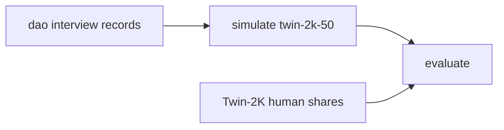

# popbench

An LLM answers as a person drawn from interview or persona data, then those answers are scored against real human response shares. **Twin-2K-500** is the labeled U.S. sample. **Nemotron-Personas** is a synthetic population with demographics and personality narratives, and no survey answers, so it can be simulated and compared only in aggregate.

The benchmark that runs now is **twin-2k-50**: the 44-item Big Five Inventory plus six green-consumption items. The code is three packages:

- **dao** builds one record per person: persona card, 50 turns, and gold answers where the source has them.
- **simulate** has the model answer as that person, one question per turn, keeping earlier answers in the thread.
- **evaluate** scores the saved answers. Nemotron panels are compared to the Twin-2K option shares. Twin-2K panels are also scored person by person, because those records hold the human choice.

Persona conditions:

- `full_twin2k` and `demographics_only` — the Twin-2K panel. The persona card is demographics only, so the 50 answers stay out of the prompt.
- `nemotron_usa` — a stratified Nemotron-USA sample asked the same 50 items.

Open-ended items are out of scope. A good score is not evidence that the model can replace a human study.



## Install

Python 3.11 or newer.

```bash
python -m venv .venv
source .venv/bin/activate
pip install -e ".[dev]"
```

## Get the data

`data/` and `runs/` are gitignored. Fetched files stay on this machine.

```bash
popbench fetch
popbench build
popbench simulate --panel nemotron
popbench evaluate --run runs/interview-v0
```

`popbench run --config configs/v1.yaml` does those three steps for the persona condition in the config. `nemotron_usa` answers as the Nemotron panel. `full_twin2k` and `demographics_only` answer as the Twin-2K panel. The Twin-2K persona card is demographics only, so the 50 answers stay out of the prompt.

`popbench fetch` downloads the Twin-2K question catalog and wave response tables, then the first parquet shard of Nemotron-Personas-USA. Pass `--nemotron-shards N` (1–11) to cache more shards. The loader checks the published shapes: 2,058 respondents, 256 catalog entries, 761 wave 1–3 columns, and 127 wave 4 columns. It does not read every Nemotron persona text into memory.

`popbench build` writes the twin-2k-50 records under `data/interview/v0/`: one Twin-2K panel, one Nemotron panel, and the human answer shares. The instrument is the 44-item Big Five Inventory plus six green-consumption items.

`popbench simulate` asks the model those 50 questions, one turn at a time, as each person in the panel. Earlier answers stay in the chat. `evaluate` scores the saved strings and does not call the model again. The client calls DeepSeek. Put `DEEPSEEK_API_KEY` in `.env` (see `.env.example`). `DEEPSEEK_BASE_URL` defaults to `https://api.deepseek.com` and `DEEPSEEK_MODEL` defaults to `deepseek-flash`. Each call is cached by model, persona id, and item id.

## Dataset map

### Synthetic personas

These are grounded in census-style margins. They do not contain each person's opinions. License CC BY 4.0. Built with NeMo Data Designer from public demographic statistics, not from real named individuals.

- Collection index: [nvidia/nemotron-personas](https://huggingface.co/collections/nvidia/nemotron-personas). Use that page as the index for other locales (Singapore, France, South Korea, Brazil, and others). Do not guess dataset ids.
- [nvidia/Nemotron-Personas](https://huggingface.co/datasets/nvidia/Nemotron-Personas) — earlier U.S. release, about 100k records / 600k persona texts.
- [nvidia/Nemotron-Personas-USA](https://huggingface.co/datasets/nvidia/Nemotron-Personas-USA) — about 1M records and 6M persona texts, aligned to U.S. Census, BLS occupations, geography, and personality-trait margins. `load_dataset("nvidia/Nemotron-Personas-USA")`. This is the persona pool v1 samples.
- [nvidia/Nemotron-Personas-Japan](https://huggingface.co/datasets/nvidia/Nemotron-Personas-Japan) — Japanese personas.
- [nvidia/Nemotron-Personas-India](https://huggingface.co/datasets/nvidia/Nemotron-Personas-India) — configs `en_IN`, `hi_Deva_IN`, `hi_Latn_IN`.
- Design notes: [Designing Nemotron-Personas](https://docs.nvidia.com/nemo/datadesigner/dev-notes/designing-nemotron-personas). Extended fields (synthetic addresses, income bands) stay inside NeMo Data Designer and are not all on the public Hugging Face dump.
- Do not use NVIDIA **Nemotron-CC** or other Nemotron pretraining corpora. Those are web text, not people.
- [PersonaHub](https://github.com/tencent-ailab/persona-hub) (Tencent, “Scaling Synthetic Data Creation with 1,000,000,000 Personas”) — about 1B short personas mined from the web. Much larger, and much less tied to census margins. Public Hugging Face copies are partial mirrors; check the dataset card before relying on one.

### Labeled humans

These are the benchmark datasets.

- [LLM-Digital-Twin/Twin-2K-500](https://huggingface.co/datasets/LLM-Digital-Twin/Twin-2K-500) — primary dataset for v1. Paper: [arxiv.org/abs/2505.17479](https://arxiv.org/abs/2505.17479) (Toubia et al., Marketing Science 2025, CC BY 4.0). N = 2,058 U.S. adults, Prolific, representative on age, sex, and ethnicity, about 2.42 hours each, four waves. Files this package caches: `question_catalog.json`, `wave1_3_response.csv` (2,058 × 761), `wave1_3_response_label.csv`, `wave4_response.csv`, and `wave4_response_label.csv`. Covers demographics, personality and values, cognition, economic preferences, 11 between-subject and 5 within-subject heuristics-and-biases experiments, and a 40-item pricing / purchase survey. Wave 4 repeats the experiments and pricing items and is the human consistency ceiling.
- [tatsu-lab/opinions_qa](https://github.com/tatsu-lab/opinions_qa) — OpinionQA (Santurkar et al.). About 1,498 multiple-choice items from Pew American Trends Panel polls, individual responses, and 60 demographic groups. Best public U.S. opinion-distribution benchmark. Pew terms restrict redistribution; keep the data local and do not commit it. A JSONL convenience copy exists at `timchen0618/OpinionQA`, but prefer the official repo plus Pew’s terms. No OpinionQA loader until the Twin-2K path scores correctly.
- [Anthropic/llm_global_opinions](https://huggingface.co/datasets/Anthropic/llm_global_opinions) — GlobalOpinionQA. About 2,556 items from the World Values Survey and Pew Global Attitudes, with country-level answer percentages rather than individuals. Later adapter for scoring a Nemotron locale as a country. The item type already has an optional country and a human share vector.
- [HannahRoseKirk/prism-alignment](https://huggingface.co/datasets/HannahRoseKirk/prism-alignment) — PRISM. Survey profiles plus conversation preferences from participants in many countries. Useful for how a population wants an assistant to behave, and weaker for purchase and behavioral-econ decisions.
- Classic microdata, downloaded from the survey owner rather than Hugging Face: [General Social Survey](https://gss.norc.org/), [American National Election Studies](https://electionstudies.org/), [World Values Survey](https://www.worldvaluessurvey.org/), [European Social Survey](https://www.europeansocialsurvey.org/), [Pew American Trends Panel](https://www.pewresearch.org/american-trends-panel/).
- Park et al., “Generative Agent Simulations of 1,000 People” ([arxiv.org/abs/2411.10109](https://arxiv.org/abs/2411.10109)) is the interview-based twin result often cited (agents matched GSS answers about 85% as well as people matched themselves two weeks later). The interview transcripts are not a public drop-in dataset. Twin-2K was released to fill that gap.

## Layout

The benchmark code is three packages:

- `src/popbench/dao` — interview and persona datasets become records. Twin-2K-50 is one person, a persona card, and 50 turns. Gold answers stay on the record and out of the prompt.
- `src/popbench/simulate` — the model answers as that person, one twin-2k-50 question per turn, with earlier answers kept in the thread.
- `src/popbench/evaluate` — closeness of simulated personalities to Twin-2K humans: exact match and ordinal accuracy, Pearson correlations, quadratic weighted kappa, total variation, Jensen-Shannon, 1-Wasserstein and OpinionQA alignment, Kolmogorov-Smirnov, scale-score error, variance ratio, and Cronbach's alpha. A saved run can be scored again without new model calls.

`configs/v1.yaml` chooses the persona condition, `n_people`, `full_n`, and seed. `src/popbench/cli.py` runs fetch, build, simulate, and evaluate.

## License notes

Twin-2K-500 and Nemotron-Personas are CC BY 4.0. Pew, GSS, and ANES files are not committed. Keep any local copy of those surveys out of git. This package does not vendor them.
