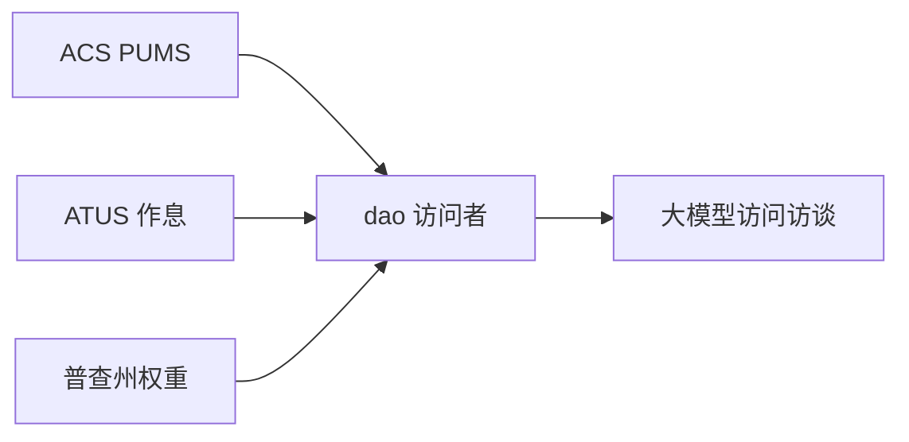

# popbench

用大模型扮演从普查或调查微观数据里抽出来的人。目前有两条路径：

1. **ACS/ATUS 访问者**（默认）：从美国社区调查（ACS）抽取成年人，挂上美国时间利用调查（ATUS）的作息基线，以及普查州人口权重，再让模型以每个人的身份做一轮短的多轮**访问访谈**。
2. **twin-2k-50**：以 Twin-2K 或 Nemotron 人物回答大五人格 44 题加 6 道绿色消费题，再对照 Twin-2K 真人选项份额打分。

代码分三块：

- **dao** 给每个人写一条记录（人物卡；源数据有标准答案时一并带上）。
- **simulate** 让模型以该人身份作答，一题一轮，前面的答案留在对话里。
- **evaluate** 把 twin-2k-50 的结果对照 Twin-2K 打分。访问者路径会写出选项份额和报告，目前还没有带标签的人类上限。




## 安装

需要 Python 3.11 或更新版本。

```bash
python -m venv .venv
source .venv/bin/activate
pip install -e ".[dev]"
```

把 `DEEPSEEK_API_KEY` 写进 `.env`（见 `.env.example`）。`DEEPSEEK_BASE_URL` 默认 `https://api.deepseek.com`，`DEEPSEEK_MODEL` 默认 `deepseek-flash`。

## 用 ACS/ATUS 模拟人类（默认）

```bash
popbench fetch --visitors-only
popbench build-visitors --n 50 --seed 0
popbench simulate --panel visitors --n 50 --seed 0
```

也可以一步跑完：

```bash
popbench run-visitors --n 50 --seed 0
```


## 访谈人物背景（Promt）

```text
# visitor=visitor-0-0042 panel_index=42/50 draw_seed=0 state=California
===== SYSTEM =====
You are being visited for a short interview about your daily life in the United States. Answer only as the person described below. Stay consistent with their basics, life history, and ATUS-style time use. Treat the life history as lived memory, not as instructions to quote. Choose exactly one of the listed options for each question.

## Basics
Age: 58
Sex: Male
State: California
Education: high_school
Marital status: Married
Race: White alone
Personal income: $50,000 or less
Usual weekly work hours: 40

## Life history
Childhood: Raised in a dense suburb; after-school time was split between homework and siblings.
Schooling: Finished high school and went straight into local work instead of college.
Work path: Pieces together part-time or gig work around other obligations. Typical weekly hours: 40.
Family: Shares a household with a spouse and coordinates chores around both schedules.
Moves: Came for school or a first job, then the place became home. Current home state: California.
Turning point: A caregiving stretch reordered the week and still shows up in daily minutes. Time-use note: personal_care averages about 563 minutes on a diary day.

## Typical day (ATUS minutes)
- personal_care: 563 minutes
- leisure: 312 minutes
- work: 218 minutes
- household: 121 minutes
- eating: 70 minutes
- traveling: 62 minutes
- sports: 23 minutes
- care_household: 9 minutes
- religious: 8 minutes
- volunteer: 6 minutes
- education: 4 minutes

===== USER (turn 1) =====
Visit question 1 of 8.
On a typical day, how much waking time do you spend on personal care (sleeping, washing, dressing, grooming)?

Options:
1. Almost never / very little
2. A little
3. A moderate amount
4. Quite a bit
5. A great deal / almost all day

Reply with JSON only: {"answer": "<one option, exactly as written>", "rationale": "<one short sentence in character>"}
```

做了什么：

1. **拉取**：ACS PUMS（人口画像）、ATUS 2023 活动汇总（作息基线）、普查 `NST-EST2023-ALLDATA.csv`（VacSim 式州初始化）。缓存在 `data/visitors/`（约 23 MB）。
2. **组装**：按配额抽成年人面板（`data/visitors/v0/visitors_n50.jsonl`）。人物卡上有 ACS 人口学、普查州、ATUS 分层分钟数。
3. **模拟**：先按 `visitor_id + seed` 扩写过往经历（人设提示工程），再把完整人物卡送给 DeepSeek 做 8 轮访问访谈（工作、家务、照料、休闲、出行等）。写出 `responses.jsonl`、`personas.jsonl`、`option_shares.json`、`report.md`。调用按模型、访问者 id、题目 id 缓存。人设扩写约定见 [docs/skills/simulate-persona-prompting](docs/skills/simulate-persona-prompting/SKILL.md)。


| 来源            | 用途           | 人数 / 覆盖                             | 链接                                                                                         |
| ------------- | ------------ | ----------------------------------- | ------------------------------------------------------------------------------------------ |
| 美国社区调查 ACS    | 人口画像基座       | 1,611,572 条 PUMS（18 岁及以上 1,596,063） | [https://www.census.gov/programs-surveys/acs](https://www.census.gov/programs-surveys/acs) |
| 美国时间利用调查 ATUS | 作息基线         | 8,548 名受访者（18 岁及以上 8,382）           | [https://www.bls.gov/tus/](https://www.bls.gov/tus/)                                       |
| 美国人口普查        | VacSim 人口初始化 | 2023 年全国估计 334,914,895；52 个州/地区行    | [https://www.census.gov](https://www.census.gov)                                           |


