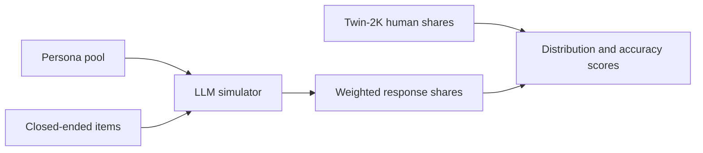

# popbench

A small benchmark that asks an LLM to answer as a population, then scores those answers against real human response shares. **Twin-2K-500** is the labeled U.S. sample. **Nemotron-Personas** is a synthetic population with demographics and personality narratives, and no survey answers, so it can be simulated but not scored on its own.

v1 has two suites and one runner:

- **Decision.** Persona context is waves 1–3 except the heuristics-and-biases items. Held-out items are those experiments plus the pricing and purchase choices. Wave 4 on the same items is the human test-retest ceiling. The report includes individual accuracy and whether simulated choice shares recover the human average treatment effect.
- **Sentiment.** Held-out items are closed-ended value and attitude batteries. Context is demographics plus the rest of the profile. The score is the distribution of answers, overall and inside age, sex, education, party, and income, not only the majority label.

Persona conditions, so a report can show what the population text is worth:

- `full_twin2k` — waves 1–3 profile (the paper protocol)
- `demographics_only` — demographic items only
- `nemotron_usa` — a stratified Nemotron-USA sample asked the same items

Nemotron personas are not Twin-2K respondents, so they are scored only in aggregate. Open-ended items (the selves questionnaire, forward-flow associations) are out of scope. Scored answers are multiple choice, Likert, binary, and numeric.

A uniform random chooser is the floor. The published Twin-2K split is the default so later runs can be compared with the paper. A good score is not evidence that the model can replace a human study. Reports state the sample size, the persona condition, and the distance to the wave-4 test-retest ceiling.



## Install

Python 3.11 or newer.

```bash
python -m venv .venv
source .venv/bin/activate
pip install -e ".[dev]"
```

## Get the data

`data/` and `runs/` are gitignored. Fetched files stay on this machine.

```bash
popbench fetch
popbench run --config configs/v1.yaml
popbench score --run runs/<id>
```

`popbench fetch` downloads the Twin-2K question catalog and wave response tables, then the first parquet shard of Nemotron-Personas-USA. Pass `--nemotron-shards N` (1–11) to cache more shards. The loader checks the published shapes: 2,058 respondents, 256 catalog entries, 761 wave 1–3 columns, and 127 wave 4 columns. It does not read every Nemotron persona text into memory.

`popbench run` loads `configs/v1.yaml` and that cache. The default run uses 50 people. Set `full_n: true` for all 2,058 Twin-2K respondents. The model client is not wired yet, so `run` does not make API calls. `score` will read saved raw model strings from a run directory once scoring is implemented, which means a scoring change does not require new calls.

The client calls DeepSeek. Put `DEEPSEEK_API_KEY` in `.env` (see `.env.example`). `DEEPSEEK_BASE_URL` defaults to `https://api.deepseek.com` and `DEEPSEEK_MODEL` defaults to `deepseek-flash`. Each call is cached by model, persona id, and item id.

## Dataset map

### Synthetic personas

These are grounded in census-style margins. They do not contain each person's opinions. License CC BY 4.0. Built with NeMo Data Designer from public demographic statistics, not from real named individuals.

- Collection index: [nvidia/nemotron-personas](https://huggingface.co/collections/nvidia/nemotron-personas). Use that page as the index for other locales (Singapore, France, South Korea, Brazil, and others). Do not guess dataset ids.
- [nvidia/Nemotron-Personas](https://huggingface.co/datasets/nvidia/Nemotron-Personas) — earlier U.S. release, about 100k records / 600k persona texts.
- [nvidia/Nemotron-Personas-USA](https://huggingface.co/datasets/nvidia/Nemotron-Personas-USA) — about 1M records and 6M persona texts, aligned to U.S. Census, BLS occupations, geography, and personality-trait margins. `load_dataset("nvidia/Nemotron-Personas-USA")`. This is the persona pool v1 samples.
- [nvidia/Nemotron-Personas-Japan](https://huggingface.co/datasets/nvidia/Nemotron-Personas-Japan) — Japanese personas.
- [nvidia/Nemotron-Personas-India](https://huggingface.co/datasets/nvidia/Nemotron-Personas-India) — configs `en_IN`, `hi_Deva_IN`, `hi_Latn_IN`.
- Design notes: [Designing Nemotron-Personas](https://docs.nvidia.com/nemo/datadesigner/dev-notes/designing-nemotron-personas). Extended fields (synthetic addresses, income bands) stay inside NeMo Data Designer and are not all on the public Hugging Face dump.
- Do not use NVIDIA **Nemotron-CC** or other Nemotron pretraining corpora. Those are web text, not people.
- [PersonaHub](https://github.com/tencent-ailab/persona-hub) (Tencent, “Scaling Synthetic Data Creation with 1,000,000,000 Personas”) — about 1B short personas mined from the web. Much larger, and much less tied to census margins. Public Hugging Face copies are partial mirrors; check the dataset card before relying on one.

### Labeled humans

These are the benchmark datasets.

- [LLM-Digital-Twin/Twin-2K-500](https://huggingface.co/datasets/LLM-Digital-Twin/Twin-2K-500) — primary dataset for v1. Paper: [arxiv.org/abs/2505.17479](https://arxiv.org/abs/2505.17479) (Toubia et al., Marketing Science 2025, CC BY 4.0). N = 2,058 U.S. adults, Prolific, representative on age, sex, and ethnicity, about 2.42 hours each, four waves. Files this package caches: `question_catalog.json`, `wave1_3_response.csv` (2,058 × 761), `wave1_3_response_label.csv`, `wave4_response.csv`, and `wave4_response_label.csv`. Covers demographics, personality and values, cognition, economic preferences, 11 between-subject and 5 within-subject heuristics-and-biases experiments, and a 40-item pricing / purchase survey. Wave 4 repeats the experiments and pricing items and is the human consistency ceiling.
- [tatsu-lab/opinions_qa](https://github.com/tatsu-lab/opinions_qa) — OpinionQA (Santurkar et al.). About 1,498 multiple-choice items from Pew American Trends Panel polls, individual responses, and 60 demographic groups. Best public U.S. opinion-distribution benchmark. Pew terms restrict redistribution; keep the data local and do not commit it. A JSONL convenience copy exists at `timchen0618/OpinionQA`, but prefer the official repo plus Pew’s terms. No OpinionQA loader until the Twin-2K path scores correctly.
- [Anthropic/llm_global_opinions](https://huggingface.co/datasets/Anthropic/llm_global_opinions) — GlobalOpinionQA. About 2,556 items from the World Values Survey and Pew Global Attitudes, with country-level answer percentages rather than individuals. Later adapter for scoring a Nemotron locale as a country. The item type already has an optional country and a human share vector.
- [HannahRoseKirk/prism-alignment](https://huggingface.co/datasets/HannahRoseKirk/prism-alignment) — PRISM. Survey profiles plus conversation preferences from participants in many countries. Useful for how a population wants an assistant to behave, and weaker for purchase and behavioral-econ decisions.
- Classic microdata, downloaded from the survey owner rather than Hugging Face: [General Social Survey](https://gss.norc.org/), [American National Election Studies](https://electionstudies.org/), [World Values Survey](https://www.worldvaluessurvey.org/), [European Social Survey](https://www.europeansocialsurvey.org/), [Pew American Trends Panel](https://www.pewresearch.org/american-trends-panel/).
- Park et al., “Generative Agent Simulations of 1,000 People” ([arxiv.org/abs/2411.10109](https://arxiv.org/abs/2411.10109)) is the interview-based twin result often cited (agents matched GSS answers about 85% as well as people matched themselves two weeks later). The interview transcripts are not a public drop-in dataset. Twin-2K was released to fill that gap.

## Layout

- `configs/v1.yaml` — suite, persona condition, `n_people`, `full_n`, item cap, seed
- `src/popbench/schema.py` — one item type: id, prompt, options, kind, wave, suite, subgroup columns
- `src/popbench/twin2k.py` — cache and load Twin-2K-500
- `src/popbench/personas.py` — Nemotron shard cache; profile rendering comes next
- `src/popbench/simulate.py` — cache key and model settings; the chat client comes next
- `src/popbench/metrics.py`, `src/popbench/report.py` — accuracy, TVD, JS, ordinal MAE, subgroup TVD, treatment-effect error, then a JSON and Markdown report

## License notes

Twin-2K-500 and Nemotron-Personas are CC BY 4.0. Pew, GSS, and ANES files are not committed. Keep any local copy of those surveys out of git. This package does not vendor them.
